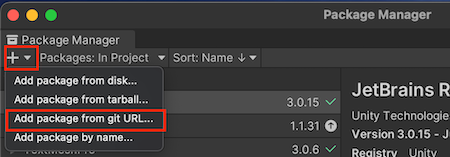
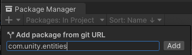
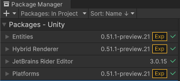
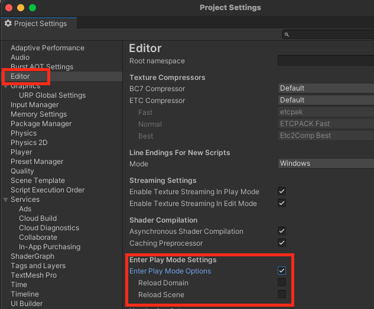

# Unity-DOTS

## Installation and Setup

Window -> Package Manager

- `com.unity.entities`
- `com.unity.rendering.hybrid`
- `com.unity.platforms`

Add package from git URL ... 

enter package `com.unity.entities` and `com.unity.rendering.hybrid`

Edit -> Projects Settings -> activate "`Enter Play Mode Options`"

## Package changelog

https://docs.unity3d.com/Packages/com.unity.entities@0.51/changelog/CHANGELOG.html

https://docs.unity3d.com/Packages/com.unity.rendering.hybrid@0.51/changelog/CHANGELOG.html

https://docs.unity3d.com/Packages/com.unity.platforms@1.0/changelog/CHANGELOG.html

## Package manual

https://docs.unity3d.com/Packages/com.unity.entities@0.51/manual/index.html